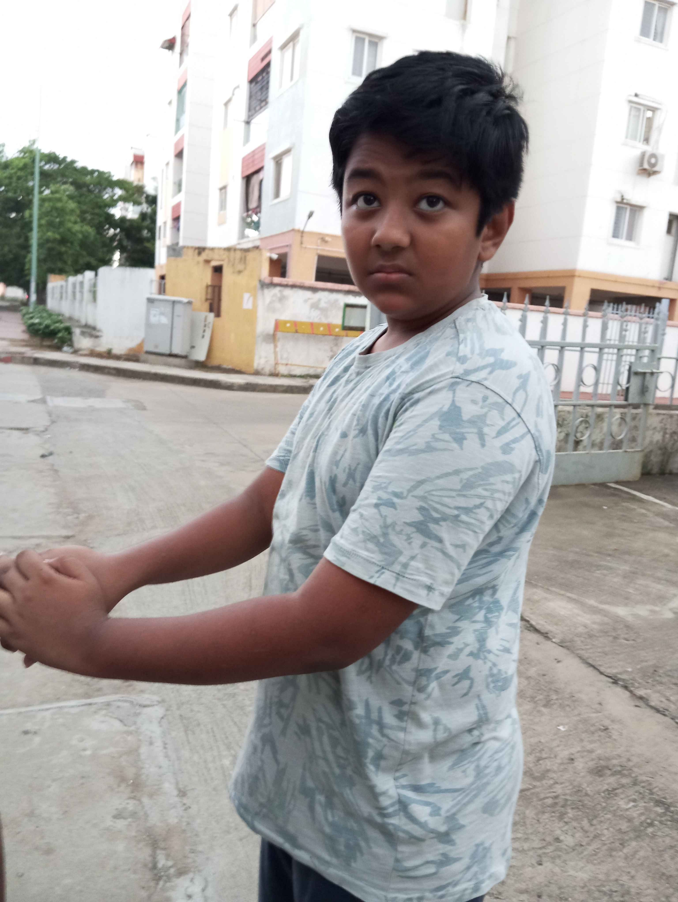

# Headline

> An awesome project.
# About Ganesh

> Ganesh is a short, round man with a cheerful demeanor, known for his love of good food. He is the proud owner of the popular restaurant A3B, where he often indulges in his favorite dish, ladoo, a sweet treat he can never resist. His passion for food has made him a well-recognized figure in the community, where he is known for his hearty appetite and joyful nature. Ganesh, of Syrian descent, believes strongly in the power of luck and has an affinity for the number 8, which he considers his lucky charm. His restaurant is both a business and a place of comfort, where he enjoys the pleasures of food surrounded by loyal customers.

## Nicknames of Ganesh

- GKR (abr. Ganesh Krishna Ramachandran)
- Syrian Shake (Thank you Apple autocorrect)
- Gonesh (Unknown Orgins.)

## Images of Ganesh

# Ganesh's origin story

 * Ganesh had always been different. Born into a modest family of Syrian descent, he grew up surrounded by the scent of spices and the warmth of home-cooked meals. His childhood was filled with laughter, love, and food—always food. But behind the joy and the comforting meals, Ganesh carried a quiet burden.

 * As a boy, he was often teased for his round frame and insatiable appetite. The other kids called him names, poking fun at his love for sweets, especially ladoos, which his mother made to cheer him up. But Ganesh didn’t let their words break him. He found solace in the kitchen, where the clinking of pots and the sizzle of spices became his escape.

 * His father, a hard-working man, taught him the value of perseverance. "Life isn’t about what they say about you," his father would remind him, "it's about what you build for yourself." Ganesh took those words to heart. He knew that food wasn’t just something that filled bellies—it brought people together, creating memories and healing wounds.

 * In his early years, Ganesh scraped together every bit of savings he had and opened A3B, a small restaurant that would one day become the heart of the community. He poured his soul into the place, offering not just food, but comfort. People didn’t just come for the meals—they came for Ganesh's welcoming smile, his hearty laugh, and the sense of belonging he provided. It wasn’t long before A3B grew, and Ganesh became a respected figure in the community.

 * But the journey wasn’t without its hardships. Ganesh faced financial struggles, personal heartbreaks, and moments of doubt. Yet, every time life knocked him down, he found his way back to the kitchen, the one place where he could find balance and purpose. It was there, amidst the simmering curries and the sweet smell of ladoos, that he realized his true calling: to create a place where everyone, no matter their background or struggles, could feel at home.

 * Ganesh’s lucky number, 8, became a symbol of his resilience. It represented infinity—an endless cycle of challenges and triumphs, losses and gains. Just like the number 8, Ganesh knew that no matter how many times life looped around, he would always come out the other side, stronger.

* Now, Ganesh sits at the center of his community, much like the center of the universe for those around him. His restaurant, A3B, is a hub of connection, a place where people gather not just for food, but for the warmth and wisdom Ganesh offers. Through all his struggles, Ganesh found that his true gift wasn’t just in his cooking—it was in his ability to bring people together, to nourish not just their bodies but their souls.
