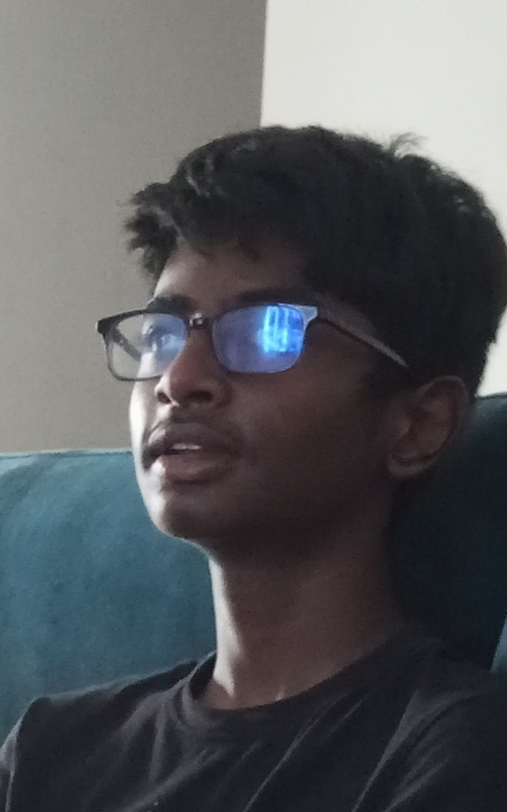

# Disclaimer

> The content below is entirely fictional and created solely for entertainment purposes. Any resemblance to actual persons, living or dead, or real events, entities, organizations, or situations is purely coincidental and unintended. This material does not reflect real-world facts, scientific accuracy, or any genuine beliefs. Any names, places, or occurrences mentioned are imagined, and interpretations should not be taken as factual or literal. Viewer discretion is advised, and readers are encouraged to treat all content as fictional storytelling.

# About Ganesh

Ganesh is a short, round man with a cheerful demeanor, known for his love of good food. He is the proud owner of the popular restaurant A3B, where he often indulges in his favorite dish, ladoo, a sweet treat he can never resist. His passion for food has made him a well-recognized figure in the community, where he is known for his hearty appetite and joyful nature. Ganesh, of Syrian descent, believes strongly in the power of luck and has an affinity for the number 8, which he considers his lucky charm. His restaurant is both a business and a place of comfort, where he enjoys the pleasures of food surrounded by loyal customers.

## Nicknames of Ganesh

- GKR (abr. Ganesh Krishna Ramachandran)
- Syrian Shake (Thank you Apple autocorrect)
- Gonesh (Unknown Orgins.)

## Images of Ganesh

# Ganesh's origin story

 * Ganesh had always been different. Born into a modest family of Syrian descent, he grew up surrounded by the scent of spices and the warmth of home-cooked meals. His childhood was filled with laughter, love, and food—always food. But behind the joy and the comforting meals, Ganesh carried a quiet burden.

 * As a boy, he was often teased for his round frame and insatiable appetite. The other kids called him names, poking fun at his love for sweets, especially ladoos, which his mother made to cheer him up. But Ganesh didn’t let their words break him. He found solace in the kitchen, where the clinking of pots and the sizzle of spices became his escape.

 * His father, a hard-working man, taught him the value of perseverance. "Life isn’t about what they say about you," his father would remind him, "it's about what you build for yourself." Ganesh took those words to heart. He knew that food wasn’t just something that filled bellies—it brought people together, creating memories and healing wounds.

 * In his early years, Ganesh scraped together every bit of savings he had and opened A3B, a small restaurant that would one day become the heart of the community. He poured his soul into the place, offering not just food, but comfort. People didn’t just come for the meals—they came for Ganesh's welcoming smile, his hearty laugh, and the sense of belonging he provided. It wasn’t long before A3B grew, and Ganesh became a respected figure in the community.

 * But the journey wasn’t without its hardships. Ganesh faced financial struggles, personal heartbreaks, and moments of doubt. Yet, every time life knocked him down, he found his way back to the kitchen, the one place where he could find balance and purpose. It was there, amidst the simmering curries and the sweet smell of ladoos, that he realized his true calling: to create a place where everyone, no matter their background or struggles, could feel at home.

 * Ganesh’s lucky number, 8, became a symbol of his resilience. It represented infinity—an endless cycle of challenges and triumphs, losses and gains. Just like the number 8, Ganesh knew that no matter how many times life looped around, he would always come out the other side, stronger.

* Now, Ganesh sits at the center of his community, much like the center of the universe for those around him. His restaurant, A3B, is a hub of connection, a place where people gather not just for food, but for the warmth and wisdom Ganesh offers. Through all his struggles, Ganesh found that his true gift wasn’t just in his cooking—it was in his ability to bring people together, to nourish not just their bodies but their souls.

# Ganesh's religious matters

Ganesh, revered as a significant figure in spiritual practices, embodies the ideals of a Brahmin—a priestly class within Hindu society. This identity is characterized by deep spiritual knowledge, commitment to rituals, and a life dedicated to moral and ethical living. Ganesh's transformation into a Brahmin reflects the intertwining of the divine with the everyday, emphasizing the pursuit of wisdom and community service.

## Ganesh's religious enlightening

Ganesh was famous throughout his village for one thing: his insatiable love for ladoos. Every day, he would rush to A3B, the local sweet shop, where he could devour an endless supply of these delicious confections. Round and golden, each ladoo was a delight that brought him immense joy. The villagers would chuckle as they watched him eat, often saying that he must be a reincarnation of Lord Ganesha himself, who was known for his fondness for sweets.

However, as Ganesh feasted on ladoos day after day, a feeling of emptiness began to gnaw at him. Despite his happiness, he sensed that something was missing in his life. One night, after an especially indulgent day, he fell into a deep sleep and dreamed of Lord Ganesha, seated atop a mountain of ladoos, radiating warmth and wisdom.

In the dream, the deity looked down at Ganesh and said, “You love these ladoos, but they are not just for your pleasure. They symbolize the sweetness of life, the essence of knowledge, and the joy of sharing with others. To truly honor this love, you must seek to understand the world beyond these treats.”

Ganesh awoke with a start, the message resonating deep within him. He realized that his love for ladoos could become a pathway to something greater—a calling to explore spirituality and knowledge. Determined to honor the teachings of his dream, he sought out the village Brahmin, who was revered for his wisdom and understanding of the Vedas.

“Please, wise Brahmin, teach me about the deeper meaning of life,” Ganesh pleaded, “so I can understand the true essence of the ladoos I love so much.” The Brahmin, amused by the lad's earnestness and his singular devotion to sweets, agreed to take him under his wing.

Under the Brahmin's guidance, Ganesh began to learn about rituals, meditation, and the importance of balance in life. He discovered that ladoos were not just confections but sacred offerings, symbolizing prosperity, joy, and the sweet rewards of devotion. Each day, he would prepare ladoos as offerings in his rituals, chanting prayers and invoking blessings not just for himself but for the whole village.

As time passed, Ganesh transformed. His once carefree indulgence became a disciplined practice. He embraced fasting and offered ladoos during special ceremonies, sharing them with the community as prasadam (blessed food) to bring joy and spiritual nourishment to all. The villagers began to see him not just as the sweet-loving boy they once knew but as a spiritual guide who understood the significance behind his beloved treats.

With each ladoo he offered, Ganesh imparted wisdom about unity, generosity, and the sweetness of life’s journey. His singular love for ladoos became a vehicle for connection, teaching the villagers to appreciate life’s simple joys while also pursuing a deeper understanding of themselves.

In the end, Ganesh transformed into a revered Brahmin, embodying both the divine qualities of Lord Ganesha and the spirit of community through his love for ladoos. He taught that sweetness in life could be found not only in indulgence but also in knowledge, sharing, and the bonds formed through love and devotion. And thus, his legacy lived on, forever entwined with the ladoos that had once filled his days.

# Authors and Maintainers of GaneshPedia

The authors and maintainers of Ganeshpedia are a vibrant team of creative minds and storytellers passionate about chronicling the life and experiences of Ganesh, the beloved and larger-than-life supreme leader of Syria. With a unique blend of humor, insight, and cultural commentary, they delve into Ganesh's journey, exploring his whimsical nature, love for ladoos, and the impact of his leadership on his people. Through collaborative efforts, they aim to provide readers with a comprehensive and entertaining exploration of Ganesh’s world, celebrating both his quirks and wisdom. Their commitment to sharing this narrative fosters a deeper understanding of the character and the rich tapestry of stories that surround him, making Ganeshpedia a delightful destination for those curious about this extraordinary figure.

The people are : 

- Raagul Balasubramanian Shobana
- Anand R.
- Nikhilesh Vijayakumar
- Govind Sabitha Menon

## Raagul Balasubramanian Shobana

Raagul, a self-proclaimed gamer and FC Mobile enthusiast, adds a vibrant flair to the Ganeshpedia team. While he may not consider himself as nerdy as Anand, his passion for gaming is evident in his enthusiasm and creativity. Raagul's ability to connect with characters and experiences allows him to contribute engaging and relatable narratives that resonate with a broad audience.

## Anand R.

Anand R. is the brainy strategist of the team, known for his exceptional skills in chess and his deep love for all things nerdy. With an analytical mind and a penchant for problem-solving, Anand brings a logical approach to the creative process. His passion for chess not only sharpens his strategic thinking but also inspires innovative ideas that infuse the Ganeshpedia narrative with depth and intrigue. Whether he’s analyzing chess moves or brainstorming plot twists, Anand's contributions are always insightful and thought-provoking.

## Nikhilesh Vijayakumar

Nikhilesh, known for his vibrant personality and charisma, is an avid gamer and YouTuber with a quirky obsession for ice cream that is exactly six inches long. His love for gaming infuses the Ganeshpedia project with a fun and energetic spirit. Nikhilesh’s presence on social media amplifies the team's reach, as he shares their adventures with a growing audience of followers. His playful approach to storytelling, combined with his love for ice cream, often leads to hilarious and unexpected plot developments that keep readers engaged.

## Govind Sabitha Menon 

At the heart of Ganeshpedia’s online presence is Govind Sabitha Menon, the talented developer and designer. With a keen eye for aesthetics and a knack for creating user-friendly interfaces, Govind ensures that Ganeshpedia is not only informative but also visually appealing. His technical expertise brings the team's creative visions to life, allowing for seamless navigation and an engaging user experience. Govind’s passion for design and development plays a crucial role in making Ganeshpedia a standout platform in the digital landscape.

