# Disclaimer

!> ⚠️ The content below is entirely fictional and created solely for entertainment purposes. Any resemblance to actual persons, living or dead, or real events, entities, organizations, or situations is purely coincidental and unintended. This material does not reflect real-world facts, scientific accuracy, or any genuine beliefs. Any names, places, or occurrences mentioned are imagined, and interpretations should not be taken as factual or literal. Viewer discretion is advised, and readers are encouraged to treat all below content as fictional storytelling only.⚠️

 - Orang

# The GM friend Group

* Written below are some information about his friends from a personal standpoint.

### Ganesh Krishna Ramachandran

Ganesh is a short, round man with a cheerful demeanor, known for his love of good food. He is the proud owner of the popular restaurant A3B, where he often indulges in his favorite dish, ladoo, a sweet treat he can never resist. His passion for food has made him a well-recognized figure in the community, where he is known for his hearty appetite and joyful nature. Ganesh, of Syrian descent, believes strongly in the power of luck and has an affinity for the number 8, which he considers his lucky charm. His restaurant is both a business and a place of comfort, where he enjoys the pleasures of food surrounded by loyal customers.

### Nicknames of Ganesh

- GKR (abr. Ganesh Krishna Ramachandran)
- Syrian Shake (Thank you Apple autocorrect)
- Gonesh (Unknown Orgins.)
- DSP (Dedicated Syria புருஷன்)
- Gundesh (Gundu + Ganesh)
- Syrian President
- A3B CEO

### Images of Ganesh

<h6>[Above images is courtesy of Govind Menon]</h6>

### GIFs of Ganesh

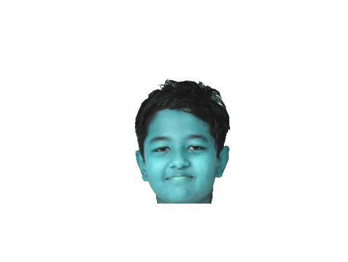

<h6>[Above GIFs is courtesy of Kavin M]</h6>

## Ganesh's origin story

 * Ganesh had always been different. Born into a modest family of Syrian descent, he grew up surrounded by the scent of spices and the warmth of home-cooked meals. His childhood was filled with laughter, love, and food—always food. But behind the joy and the comforting meals, Ganesh carried a quiet burden.

 * As a boy, he was often teased for his round frame and insatiable appetite. The other kids called him names, poking fun at his love for sweets, especially ladoos, which his mother made to cheer him up. But Ganesh didn’t let their words break him. He found solace in the kitchen, where the clinking of pots and the sizzle of spices became his escape.

 * His father, a hard-working man, taught him the value of perseverance. "Life isn’t about what they say about you," his father would remind him, "it's about what you build for yourself." Ganesh took those words to heart. He knew that food wasn’t just something that filled bellies—it brought people together, creating memories and healing wounds.

 * In his early years, Ganesh scraped together every bit of savings he had and opened A3B, a small restaurant that would one day become the heart of the community. He poured his soul into the place, offering not just food, but comfort. People didn’t just come for the meals—they came for Ganesh's welcoming smile, his hearty laugh, and the sense of belonging he provided. It wasn’t long before A3B grew, and Ganesh became a respected figure in the community.

 * But the journey wasn’t without its hardships. Ganesh faced financial struggles, personal heartbreaks, and moments of doubt. Yet, every time life knocked him down, he found his way back to the kitchen, the one place where he could find balance and purpose. It was there, amidst the simmering curries and the sweet smell of ladoos, that he realized his true calling: to create a place where everyone, no matter their background or struggles, could feel at home.

 * Ganesh’s lucky number, 8, became a symbol of his resilience. It represented infinity—an endless cycle of challenges and triumphs, losses and gains. Just like the number 8, Ganesh knew that no matter how many times life looped around, he would always come out the other side, stronger.

* Now, Ganesh sits at the center of his community, much like the center of the universe for those around him. His restaurant, A3B, is a hub of connection, a place where people gather not just for food, but for the warmth and wisdom Ganesh offers. Through all his struggles, Ganesh found that his true gift wasn’t just in his cooking—it was in his ability to bring people together, to nourish not just their bodies but their souls.

## Ganesh's religious matters

 * Ganesh, revered as a significant figure in spiritual practices, embodies the ideals of a Syrian This identity is characterized by deep spiritual knowledge, commitment to rituals, and a life dedicated to moral and ethical living. Ganesh's transformation into a Syrian reflects the intertwining of the divine with the everyday, emphasizing the pursuit of wisdom and community service.

### Ganesh's religious enlightening

 * Ganesh was famous throughout his village for one thing: his insatiable love for ladoos. Every day, he would rush to A3B, the local sweet shop, where he could devour an endless supply of these delicious confections. Round and golden, each ladoo was a delight that brought him immense joy. The villagers would chuckle as they watched him eat, often saying that he must be a reincarnation of Lord Ganesha himself, who was known for his fondness for sweets.

 * However, as Ganesh feasted on ladoos day after day, a feeling of emptiness began to gnaw at him. Despite his happiness, he sensed that something was missing in his life. One night, after an especially indulgent day, he fell into a deep sleep and dreamed of Lord Ganesha, seated atop a mountain of ladoos, radiating warmth and wisdom.

 * In the dream, the deity looked down at Ganesh and said, “You love these ladoos, but they are not just for your pleasure. They symbolize the sweetness of life, the essence of knowledge, and the joy of sharing with others. To truly honor this love, you must seek to understand the world beyond these treats.”

 * Ganesh awoke with a start, the message resonating deep within him. He realized that his love for ladoos could become a pathway to something greater—a calling to explore spirituality and knowledge. Determined to honor the teachings of his dream, he sought out the village Syrian, who was revered for his wisdom and understanding of the Vedas.

 * “Please, wise Syrian, teach me about the deeper meaning of life,” Ganesh pleaded, “so I can understand the true essence of the ladoos I love so much.” The Syrian, amused by the lad's earnestness and his singular devotion to sweets, agreed to take him under his wing.

 * Under the Syrian's guidance, Ganesh began to learn about rituals, meditation, and the importance of balance in life. He discovered that ladoos were not just confections but sacred offerings, symbolizing prosperity, joy, and the sweet rewards of devotion. Each day, he would prepare ladoos as offerings in his rituals, chanting prayers and invoking blessings not just for himself but for the whole village.

 * As time passed, Ganesh transformed. His once carefree indulgence became a disciplined practice. He embraced fasting and offered ladoos during special ceremonies, sharing them with the community as prasadam (blessed food) to bring joy and spiritual nourishment to all. The villagers began to see him not just as the sweet-loving boy they once knew but as a spiritual guide who understood the significance behind his beloved treats.

 * With each ladoo he offered, Ganesh imparted wisdom about unity, generosity, and the sweetness of life’s journey. His singular love for ladoos became a vehicle for connection, teaching the villagers to appreciate life’s simple joys while also pursuing a deeper understanding of themselves.

 * In the end, Ganesh transformed into a revered Syrian, embodying both the divine qualities of Lord Ganesha and the spirit of community through his love for ladoos. He taught that sweetness in life could be found not only in indulgence but also in knowledge, sharing, and the bonds formed through love and devotion. And thus, his legacy lived on, forever entwined with the ladoos that had once filled his days.

 > Find below Ganesh preaching 

 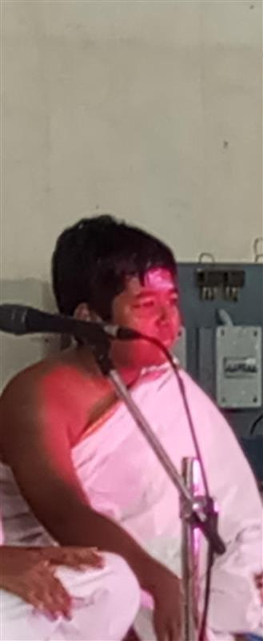

<h6>[Above image is courtesy of Govind Menon]</h6>

### The Legendary Ladoo Consumption of Ganesh

 * In the grand tapestry of Syrian leadership, few figures are as beloved as Ganesh, the rotund and jovial supreme leader, famed for his insatiable appetite for ladoos. As the sun rises over the bustling streets of Syria, Ganesh prepares for a day that can only be described as a sweet, sugary odyssey. It’s not just a few ladoos; it’s a staggering number that would make any confectionery proud.

 * Each morning, Ganesh kicks off his day with a breakfast that can only be measured in millions. That’s right—millions! Picture this: as he rolls out of bed (and we mean roll, considering his size), he has a staggering 1.5 million ladoos waiting for him, lovingly prepared by his loyal bakers. These delightful treats, bursting with flavors of cardamom and ghee, are piled high like an edible mountain.

 * By mid-morning, as Ganesh settles into his morning strategy session with his advisors, he casually downs another 750,000 ladoos. They say you can’t negotiate with an empty stomach, and Ganesh takes this advice to heart—after all, who wouldn’t want a ladoo in one hand and a policy proposal in the other?

 * Lunchtime rolls around, and while most leaders might opt for a sensible salad, Ganesh goes all out. It’s time for an extravagant ladoo feast of an additional 2 million ladoos. Yes, you read that right! While his advisors attempt to discuss economic reforms, they’re often drowned out by the sound of Ganesh munching away, his cheeks stuffed like a chipmunk preparing for winter.

 * As the sun begins to set, the evening brings yet another ladoo marathon. While most people are winding down for the day, Ganesh is just getting started with a dazzling display of 3 million ladoos for dinner. The dessert table looks like a ladoo wonderland, and he’s the king of this sugary realm, declaring it “Ladoo Independence Day” every single night.

 * When the clock strikes midnight, while most are dreaming of sugarplums, Ganesh is still on his ladoo binge, finishing off a casual 500,000 ladoos as a midnight snack. It’s a sight to behold—Ganesh, surrounded by empty ladoo boxes, declaring, “Tomorrow, we conquer the world, one ladoo at a time!”

 * In total, by the end of the day, Ganesh's ladoo consumption skyrockets to an outrageous 8 million ladoos. That’s right—8 million! With a laugh that shakes the very foundations of his palace, he wipes his sticky hands and proclaims, “If I’m going to lead Syria, I might as well do it with style and a full belly!”

 * And so, the legend of Ganesh and his ladoos continues, with tales of his epic consumption spreading far and wide, inspiring bakers everywhere to push the limits of ladoo production. After all, in the grand world of sweets and leadership, Ganesh knows one simple truth: the bigger the belly, the larger the laugh!

#### Visual representation of ladoo eating rate

[ladoo-counter](https://govindmenon.ddns.net/cdn/ladoo-counter.html ':include :type=iframe width=100% height=400px')

### Ganesh's Secretive Fitness Routine

 * Ganesh's exercise routine is a closely guarded secret, known only to his closest advisors and bakers, and he fiercely protects it from prying eyes. To the public, he attributes his "vitality" to sheer devotion and an unparalleled ladoo diet, but insiders whisper of unusual, highly specialized moves conducted in the privacy of his palace chambers.

 * It’s rumored that Ganesh begins each session with “The Quiet Reach”—a slow, meditative stretch aimed at ladoos placed at various heights, strengthening his arm muscles while subtly practicing focus and self-control. Following this, he supposedly performs “The Silent March,” a pacing ritual that looks simple to the untrained eye but, according to Ganesh, is a powerful cardiovascular exercise as he strides from one end of his study to the other, pondering the universe with a ladoo in hand.

 * Finally, there’s talk of “The Lift of Supreme Balance”—an exercise where he lifts a heavy, ornate tray of ladoos without taking a single bite, honing his legendary restraint and inner strength. Those who’ve caught glimpses say he concludes each secret session with a satisfied sigh, placing the tray back down untouched... only to “recover” from the workout by finishing a few ladoos afterward, as a reward for his discipline.

> This is an old video of Ganesh exercising as he is very secretive about it

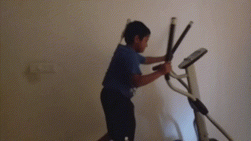

<h6>[Above clip is courtesy of Kavin Vignesh]</h6>

### Ganesh The Defender Of Syria

* Ganesh’s training with weapons is not just a skill—it’s a duty. He believes that by mastering firearms and weaponry, he strengthens both his spirit and his body, equipping himself to protect Syria and his people. Under the guidance of Syrian defense experts, Ganesh took on intense training regimens, mastering everything from traditional firearms to advanced defense techniques, viewing each exercise as both a mental and physical discipline.

* Using his weapons training as a means to fortify Syria, Ganesh sees himself as the nation’s ultimate guardian. For him, wielding weapons is not about power, but about purpose: a way to defend his homeland with strength and resilience. This dedication has made Ganesh not just a leader, but a protector—one who embraces the balance between power and wisdom in his quest to safeguard Syria’s future.

> Find below Ganesh showing his skills with a toy gun.

<h6>[Above clip courtesy of Kavin Vignesh]</h6>

### Ganesh's Enigmatic "Love" Life

* Despite his “gravitational charm” and the magnetic aura that draws people in, Ganesh’s heart has always belonged solely to Syria. Though his quiet charisma and mystery have inspired admiration from many, Ganesh remains unwavering in his dedication to his country. For him, Syria is not just a homeland but a deep, lifelong love that surpasses all others. Every decision, every sacrifice, and even his intense weapons training is in service to Syria’s future and well-being.

* Even as stories of his allure circulate, Ganesh’s one true commitment is clear. His devotion to Syria is more than patriotic—it’s a powerful, guiding force in his life. To him, no love can compete with the bond he feels for his people and his land, making him as steadfast in his loyalty as he is enigmatic in character.

> Find below Ganesh demonstrating his "Gravitational Rizz"

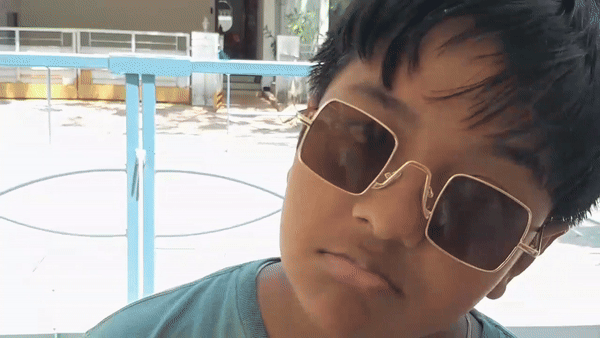

<h6>[Above clip is courtesy of Kavin Vignesh]</h6>

> Find below Ganesh's gravitational field attracting an induvidual

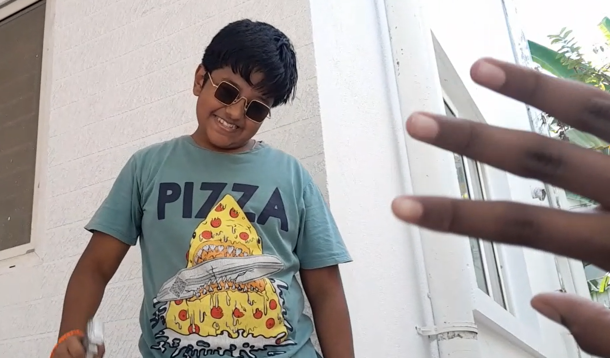

<h6>[Above image is courtesy of Kavin Vignesh]</h6>

### Secretive Syrian Software and Tech

 * Listed below are few of the rare syrian tech and software either leaked from Syria or made with leaked document specifications.

#### GaneshOS : And It's Orgins

 * GaneshOS began as a daring project by M. Kavin, who, after obtaining leaked documents, sought to lift the veil on Syria’s classified operating system architecture. Using these documents, Kavin meticulously reconstructed the OS to replicate the highly secure, state-level system that Ganesh and his inner circle reportedly used in secrecy. Kavin’s version, however, was intended not to guard secrets but to reveal the hidden workings of this elite system to the world.

<ins>Shorcuts:</ins>

- PGup and PGdn will change the background 
- UParrow DOWNarrow will change the background music volume
- Password : dsp

[GaneshOS](https://govindmenon.ddns.net/cdn/GaneshOS.html ':include :type=iframe width=640px height=360px')

[Experience GaneshOS fully](https://govindmenon.ddns.net/cdn/GaneshOS.html)

<h6>[Above project is courtesy of M Kavin]</h6>

#### LadooRUN : A Leaked Syrian Game

 * "Ladoo Run" is a legendary leaked game that began as a top-secret project intended only for Ganesh’s inner circle. But once it escaped into the public domain, it became an underground sensation. In Ladoo Run, players take on the role of Ganesh himself, navigating through endless levels of tricky Syrian landscapes,

<ins>Tutorial:</ins>

- Click with mouse or Tap to jump
- Survive or face the punishments (the meanings are yet unknown as its or secretive syrian nature)
- Collect A3B and Ladoo , Dodge everything else!

[LadooRUN](https://govindmenon.ddns.net/cdn/ladoo_run.html ':include :type=iframe width=640px height=360px')

[Experience LadooRUN fully](https://govindmenon.ddns.net/cdn/ladoo_run.html)

> here find LadooRUN V2 :

[Experience LadooRUN V2 fully](https://govindmenon.ddns.net/cdn/ladoo_run-2.html)

<h6>[Above project is courtesy of M Kavin]</h6>

### Gaming Consoles Ganesh Edition

#### PS5 Ganesh Edition

- Introducing the PS5 Gundesh Edition, the ultimate gaming console for fans of Ganesh and ladoos alike! This exclusive edition, inspired by the unique tastes and lifestyle of Ganesh himself, includes a custom ladoo-heating dock that keeps ladoos perfectly warm for mid-game snacks. Designed with extra ladoo storage, it allows gamers to keep an ample ladoo supply on hand for those marathon gaming sessions. Additionally, the PS5 Gundesh Edition comes equipped with a specialized camera, ideal for recording ladoo-eating challenges and streaming them live. With its iconic, playful design and practical ladoo enhancements, the Gundesh Edition takes gaming to a whole new level for ladoo enthusiasts everywhere.

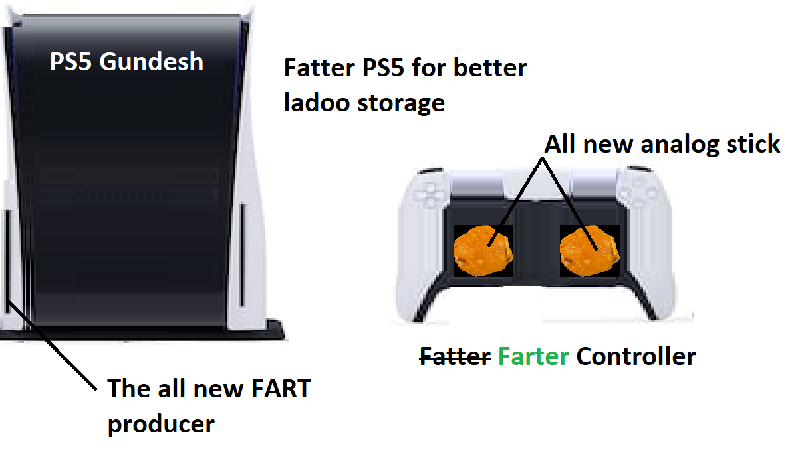

- Accessories for PS5 Ganesh Edition

<h6>[Above Images are courtesy of M Kavin]</h6>

#### Xbox Logo Ganesh Version
  

- In a legendary but short-lived partnership, Ganesh himself struck a deal with Microsoft to create a unique Xbox logo for his universe. This logo, blending the sleek design of the Xbox with Ganesh's unmistakable ladoo imagery, was intended as a tribute to his love for gaming and, of course, ladoos. The partnership was set to launch with much fanfare, with promotional events and even a Ganesh-themed Xbox console in the works. However, things took a funny twist when Ganesh reportedly demanded the logo include "more ladoo essence," which led to multiple redesigns that kept pushing the limits of Microsoft’s creativity—and patience. Rumor has it that Ganesh’s insistence on adding a ladoo-warming feature to the Xbox itself was the final straw. After a series of misunderstandings and increasingly bizarre modifications, the project was quietly shelved, leaving fans amused and speculating over what might have been. The Ganesh-Xbox logo remains a cult symbol, capturing the spirit of Ganesh’s bold but often unconventional ideas.

<h6>[Above Image is courtesy of M Kavin]</h6>

## Anand R.

* Anand R., a chess enthusiast with a passion for precision, is as much a tactician in life as he is on the board. Growing up, he spent countless hours honing his analytical skills even accomplishing the rating of 1552 : Rapid and 1469 : Std in FIDE, developing a keen eye for detail and strategy. Known for his calm and methodical nature, Anand can often be found dissecting complex problems or navigating challenges with the same patience and foresight that define his chess game. Outside of his intellectual pursuits, Anand has a curious side—often dabbling in puzzles, logic games, and the occasional trivia battle with his friends. His close friendship with Ganesh means he occasionally offers insights and perspectives on life’s “moves,” guiding his companions with a steady, reliable hand. A loyal friend and a relentless thinker, Anand brings balance, intellect, and a touch of curiosity to Ganesh’s inner circle.

* <ins>LICHESS : https://lichess.org/@/anandloks</ins>

* <ins>CHESS.COM : https://www.chess.com/member/anandloks</ins>

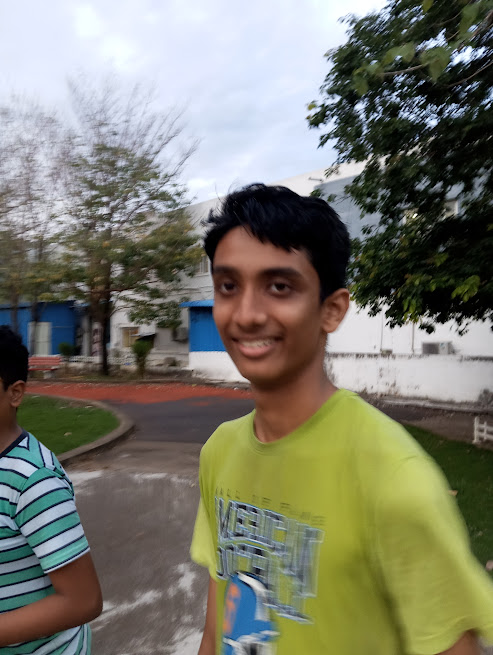

<h6>[Above image is courtesy of Govind Menon]</h6>

## Govind Sabitha Menon

* Govind Sabitha Menon is a true confluence of creativity and technical skill. As a developer, designer, artist, and musician, he brings a unique blend of talents to OrangePedia. A deep appreciation for both the arts and sciences fuels his work, and his optimistic outlook on science drives his curiosity across STEM fields. Known for his keen sense of detail, Govind not only builds digital spaces but also infuses them with his artistic touch, creating immersive and expressive experiences. When he’s not developing or designing, Govind can often be found enjoying music or playing his own compositions, adding a harmonious layer to his multifaceted personality. His friends recognize him as a creative force whose optimism and dedication make OrangePedia a vivid reflection of Ganesh’s world.

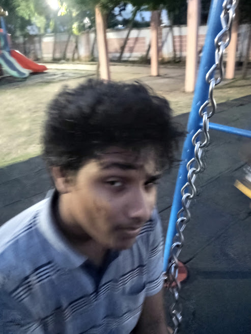

## Raagul Balasubramanian Shobana

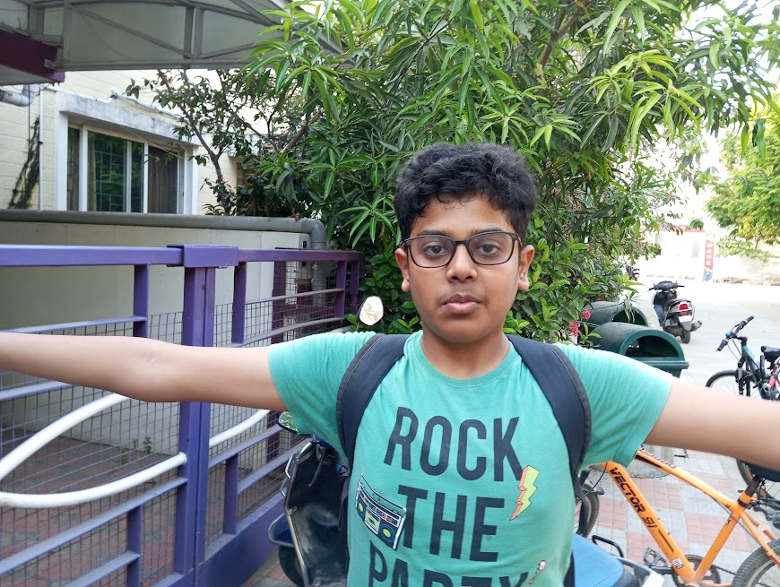
<h6>[Above image is courtesy of Govind Menon]</h6>

* Raagul Balasubramanian Shobana brings both humor and intellect to Ganesh’s inner circle known for his love of JAM and being a self-proclaimed nerd with a curious mind, he’s fascinated by science, often diving deep into the latest discoveries and theories. Known for his quick wit, Raagul balances his love for learning with his passion for FC Mobile, where he’s a formidable player with impressive skills. His friends admire his blend of humor and intelligence, as Raagul has a way of making even the most complex topics sound exciting and funny. His unique mix of curiosity, gaming expertise, and clever commentary adds an energetic and light-hearted vibe to Ganesh’s crew.

### Raagul and JAM a Saga

 * Raagul Balasubramanian Shobana is a name synonymous with jam, wit, and an inexplicable knack for turning everyday life into a comedic masterpiece. At the heart of Raagul’s personality is his enduring love for Kissan Jam, a passion so profound that he went through the lengths of legally acquiring Hindustan Unilever’s Kissan Jam. This achievement isn’t just a flex—it’s a declaration that Raagul takes his jam seriously. Friends describe his kitchen as a jam enthusiast's paradise, with shelves lined with Kissan jars of every flavor imaginable, each one gleaming like a trophy of culinary excellence.
 
 * Yet, life isn’t all jam jars and FC Mobile triumphs for Raagul. Known for his sharp intellect and curiosity, he is the quintessential nerd, diving deep into science and tech with an enthusiasm that matches his love for fruity spreads. However, his life has not been without its quirks and missteps. One such incident left him with a laceration on his right hand—an injury sustained during a school mishap involving the infamous Ilakiya Chezhilan. Though the details remain vague, the scar serves as a subtle reminder of his adventures.
 
 * In every sense, Raagul embodies a unique blend of humor, intellect, and passion. Whether he’s experimenting with new jam flavors, dominating FC Mobile leaderboards, or diving into the wonders of science, Raagul’s zest for life is as infectious as it is inspiring. His story reminds us all to find joy in the little things—like a perfectly spread slice of jam on toast.
 
### Raagul's Culinary Innovations

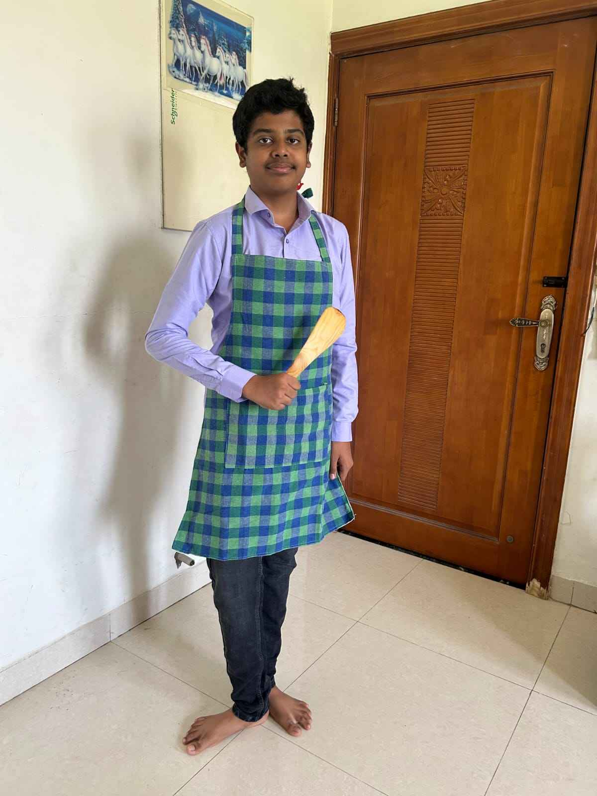
<h6>[Above image is courtesy of Raagul Balasubramanian Shobana]</h6>

 * Among Raagul Balasubramanian Shobana’s many talents, his chocolate cake stands out as a masterpiece that has earned him widespread fame among friends and family. This isn’t just any chocolate cake—it’s a moist, rich, melt-in-your-mouth creation that has left countless taste buds dancing in delight. Crafted with meticulous precision and a secret recipe he guards like a national treasure, Raagul’s chocolate cake is the highlight of every gathering.

 * Some say the magic lies in the high-quality cocoa he insists on importing, while others swear it’s his unique technique of folding in whipped cream for that perfect texture. Of course, being Raagul, he has experimented with adding jam to the mix—his Strawberry Chocolate Explosion Cake is a popular variation. Whether he’s baking it for a friend’s birthday, a celebration, or simply to share the joy of good food, Raagul’s chocolate cake never fails to steal the show.

 * Raagul’s cake-making prowess has even led to friendly rivalries, with his friends jokingly trying to outbake him, only to concede defeat after one bite of his iconic dessert. It’s no exaggeration to say that this cake has become as much a part of Raagul’s identity as his love for jam and his FC Mobile skills.

[GaneshOS](https://orangepedia.ddns.net/_media/crepe-bs.mp4 ':include :type=iframe width=100px height=200px')

<h6>[Above image is courtesy of Raagul Balasubramanian Shobana]</h6>

GaneshOS](https://orangepedia.ddns.net/_media/cake-bs.mp4 ':include :type=iframe width=100px height=200px')

## Nikhilesh Vijayakumar

* Nikhilesh Vijayakumar is a dynamic presence in Ganesh’s circle, known for his dual passions: gaming and ice cream. An avid gamer, he spends countless hours honing his skills in various games, often sharing his adventures and insights on his popular YouTube channel. Nikhilesh’s love for gaming is matched only by his quirky obsession with ice cream that’s exactly six inches long—a fun fact that his friends have turned into a running joke. With a vibrant personality and a knack for entertaining, he engages his audience with humorous commentary and gameplay tips, making him a beloved figure among his friends and followers alike. Nikhilesh’s unique interests and lively spirit add a delightful flavor to the camaraderie in Ganesh’s group.

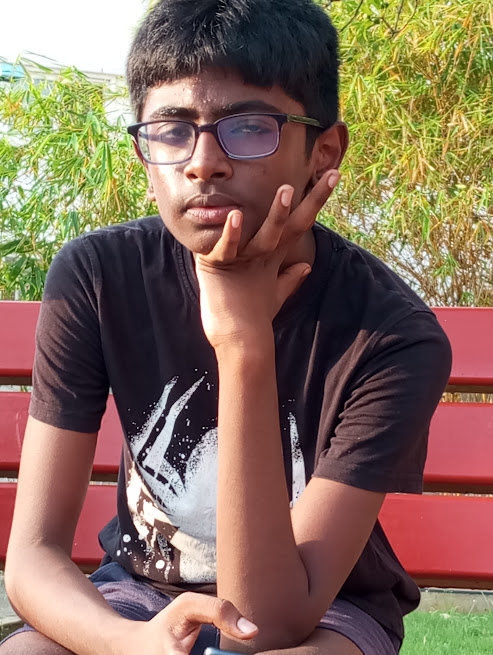
<h6>[Above image is courtesy of Govind Menon]</h6>

## Sushil Haribabu

 * Sushil Haribabu is a vibrant personality in Ganesh’s circle, known for his easygoing nature and infectious laughter. As a gamer, he finds joy in the thrill of competition and the camaraderie of online battles, often bringing a light-hearted touch to even the most intense gaming sessions. While his dark skin reflects his unique charm, Sushil occasionally struggles with communication, which sometimes leads to misunderstandings in his personal relationships. Despite his challenges, he maintains an optimistic outlook and a cheerful spirit, often finding humor in his own experiences. His friends appreciate his ability to lift their spirits and the warmth he brings to the group, proving that a good sense of humor can go a long way, even amidst life’s ups and downs.

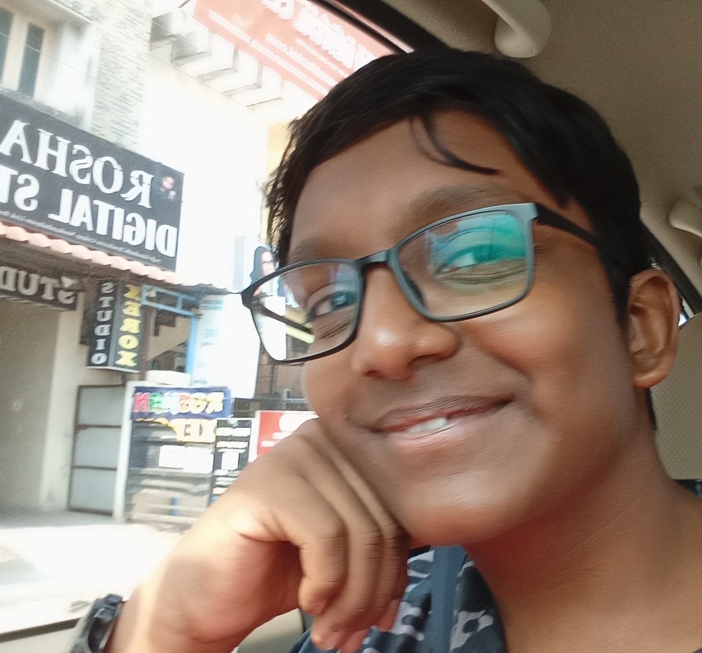
<h6>[Above image is courtesy of Govind Menon]</h6>

## Chandramoulee Sai P 

 * Chandramoulee Sai P., affectionately known as N. Moulee, is a charismatic YouTuber who has carved a niche for himself in the world of Roblox through his channel, VelocRB. With an engaging personality and a knack for creating entertaining content, N. Moulee captivates his audience with gameplay, tips, and immersive experiences. However, his playful nature has led to some bizarre rumors, including a humorous, albeit dark, reputation for “kidnapping” and storing virtual characters in his basement—a quirky way to describe his in-game antics that have sparked playful banter among his friends and fans. Despite these exaggerated tales, N. Moulee is primarily known for his creativity and humor, making him a memorable figure in Ganesh’s expansive circle of friends.

<h6>[Above image is courtesy of Govind Menon]</h6>

## Kavin Vignesh

 * Kavin Vignesh is the life of the party, known for his endless stream of jokes and infectious humor. With a passion for movies, he enjoys experimenting with filmmaking, despite being somewhat clumsy in the craft. Kavin’s enthusiasm for cinema fuels his creativity, and he approaches every project with a sense of fun, often leading to hilariously misguided results. His friends admire his ability to find laughter in every situation, making him a delightful presence in Ganesh’s circle. Whether he’s cracking jokes or sharing his latest film “masterpiece,” Kavin brings joy and a light-hearted spirit to the group, reminding everyone that it’s not just about the final product but the laughter along the way.

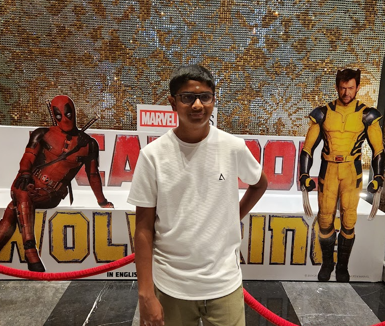
<h6>[Above image is courtesy of Govind Menon]</h6>

## Niranjan Vijayan

* Niranjan Vijayan is a charming presence in Ganesh's circle, known for his romantic spirit and flair for making meaningful connections. A passionate Free Fire player, he skillfully navigates both the virtual battlegrounds and the complexities of romance, often drawing parallels between strategic gameplay and the art of wooing. Currently living in the US, Niranjan embraces his new surroundings while staying connected to his roots and friends back home. His romantic gestures and heartfelt expressions make him a beloved figure among his peers, proving that even in the world of gaming, there’s always room for love and connection. Whether he's sharing stories of his gaming adventures or planning a thoughtful surprise for someone special, Niranjan embodies the idea that love can thrive in any environment.

### Niranjan's Famous Audio Recording:

[AVN lol](https://orangepedia.ddns.net/_media/uwu.mp3 ':include :type=iframe width=100px height=200px')

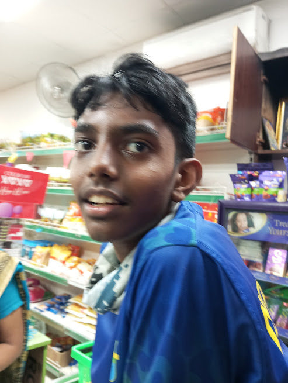
<h6>[Above image is courtesy of Govind Menon]</h6>

## Kavin M

 * Kavin M., affectionately known as JP, is a dynamic figure in Ganesh's circle, seamlessly blending his passion for coding with a sharp sense of humor. As a developer, he excels at crafting innovative solutions while keeping the mood light with his witty remarks and amusing anecdotes. Beyond his coding pursuits, Kavin is an avid football fan, passionately following his favorite teams and players, often engaging in spirited discussions about the latest matches. His nickname, JP, reflects his close bonds with friends, as he effortlessly connects with others through both his humor and shared interests. Whether he's tackling a complex coding project, cracking jokes, or cheering for his team, Kavin M. adds a lively and entertaining spirit to the camaraderie of Ganesh's world.

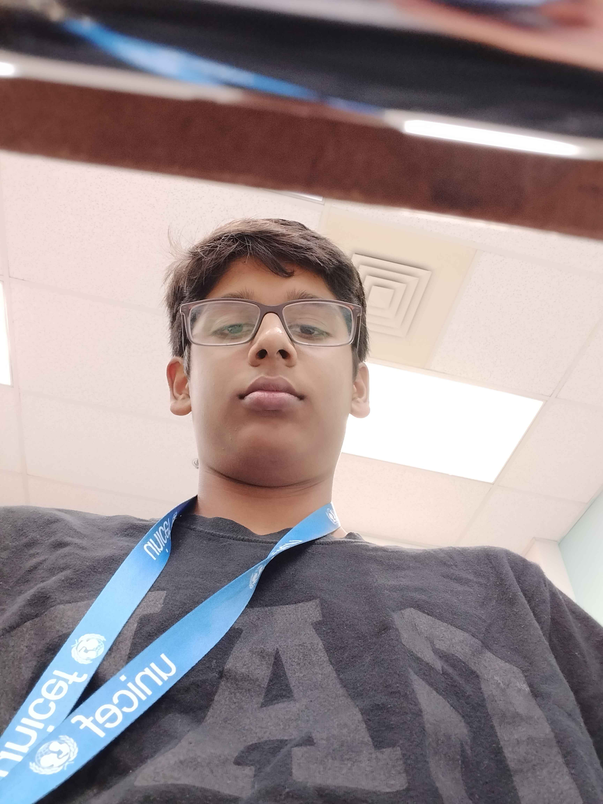
<h6>[Above image is courtesy of M Kavin]</h6>

## Shanmugamakash Rajaravisankar

 * Shanmugamakash Rajaravisankar, known for his vibrant personality, has an affinity for tea and a particular fondness for an energy drink called STING. Now based in Texas, he has transitioned from his entrepreneurial roots in India to create a unique niche for himself in the American market. With a knack for distribution, he’s become known for providing popular products like Boomer chewing gum, adding a playful touch to his business endeavors. His reputation, however, has been fueled by the more controversial aspects of his past ventures, which included the distribution of Erythroxylum and cocaine on a large scale. While these elements add intrigue to his character, Shanmugamakash remains a dynamic figure, often sharing stories over a cup of tea, showcasing his lighter side amidst the complexities of his business journey. His friends appreciate his humor and charisma, making him an unforgettable part of Ganesh's world.

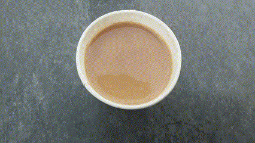
<h6>[Above image is courtesy of Kavin Vignesh and M Kavin]</h6>

## Harsh Premkumar

 * Harsh Premkumar, affectionately called "Chintu," is a well-known figure at school, especially for his love of the letter "P" — a preference with personal significance. Despite his modest height, standing just over 5 feet, Chintu has made a big impression, particularly among his female classmates. A phenomenal football player, he's celebrated for his impressive dribbling skills and his knack for scoring stunning goals. Chintu's charm and talents make him both popular and unforgettable.

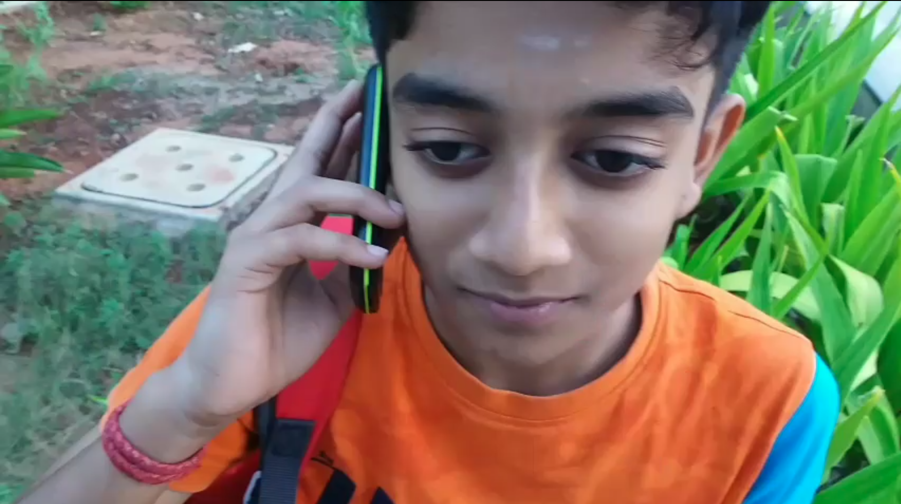

## Prithvi B Manica

 * Prithvi B Manica brings a unique blend of devotion and creativity to everything he does. Known for his love of movies, he’s often found assisting Kavin in crafting their latest film projects, adding his own flair and insights to each scene. Beyond his passion for cinema, Prithvi has a deep-rooted appreciation for traditional rituals and enjoys performing pooja, embracing his spirituality with enthusiasm. His fair complexion, often humorously referenced by friends, only adds to his distinctive presence in their circle. Prithvi is a valued friend and collaborator, seamlessly balancing his artistic passions with his reverence for tradition.

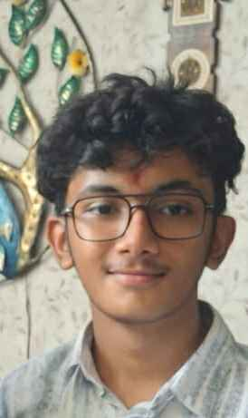

# Authors and Maintainers of OrangePedia

The authors and maintainers of OrangePedia are a vibrant team of creative minds and storytellers passionate about chronicling the life and experiences of Ganesh, the beloved and larger-than-life supreme leader of Syria. With a unique blend of humor, insight, and cultural commentary, they delve into Ganesh's journey, exploring his whimsical nature, love for ladoos, and the impact of his leadership on his people. Through collaborative efforts, they aim to provide readers with a comprehensive and entertaining exploration of Ganesh’s world, celebrating both his quirks and wisdom. Their commitment to sharing this narrative fosters a deeper understanding of the character and the rich tapestry of stories that surround him, making OrangePedia a delightful destination for those curious about this extraordinary figure.

> OrangePedia is hosted by Orange Labs GROUP.

<ins>The people are :</ins>

- Raagul Balasubramanian Shobana
- Anand R.
- Nikhilesh Vijayakumar
- Govind Sabitha Menon
- Kavin M

<ins>Special Thanks to :</ins>

- Kavin Vignesh [For providing certain clips]
- Prithvi B Manica [For providing certain clips]

## Raagul Balasubramanian Shobana

Raagul, a self-proclaimed gamer and FC Mobile enthusiast, adds a vibrant flair to the OrangePedia team. While he may not consider himself as nerdy as Anand, his passion for gaming is evident in his enthusiasm and creativity. Raagul's ability to connect with characters and experiences allows him to contribute engaging and relatable narratives that resonate with a broad audience.

## Anand R.

Anand R. is the brainy strategist of the team, known for his exceptional skills in chess and his deep love for all things nerdy. With an analytical mind and a penchant for problem-solving, Anand brings a logical approach to the creative process. His passion for chess not only sharpens his strategic thinking but also inspires innovative ideas that infuse the OrangePedia narrative with depth and intrigue. Whether he’s analyzing chess moves or brainstorming plot twists, Anand's contributions are always insightful and thought-provoking.

## Nikhilesh Vijayakumar

Nikhilesh, known for his vibrant personality and charisma, is an avid gamer and YouTuber with a quirky obsession for ice cream that is exactly six inches long. His love for gaming infuses the OrangePedia project with a fun and energetic spirit. Nikhilesh’s presence on social media amplifies the team's reach, as he shares their adventures with a growing audience of followers. His playful approach to storytelling, combined with his love for ice cream, often leads to hilarious and unexpected plot developments that keep readers engaged.

## Govind Sabitha Menon 

At the heart of OrangePedia’s online presence is Govind Sabitha Menon, the talented developer and designer. With a keen eye for aesthetics and a knack for creating user-friendly interfaces, Govind ensures that OrangePedia is not only informative but also visually appealing. His technical expertise brings the team's creative visions to life, allowing for seamless navigation and an engaging user experience. Govind’s passion for design and development plays a crucial role in making OrangePedia a standout platform in the digital landscape.

## Kavin M 

Kavin M is the brilliant co-developer behind OrangePedia, bringing his expertise and creativity to help shape this quirky and entertaining platform. With a knack for detail and a passion for crafting engaging content, Kavin works tirelessly to ensure every story, recipe, and anecdote about Ganesh comes to life in the most delightful way. His contributions add depth and humor to OrangePedia, making it the ultimate go-to resource for everything about Syria’s legendary ladoo-loving leader!

<h6>&copy; 2024 Orange Labs GROUP , All rights reserved under the CC-BY-NC license <h6>
